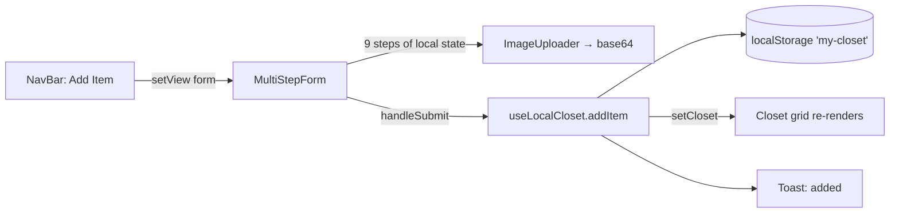
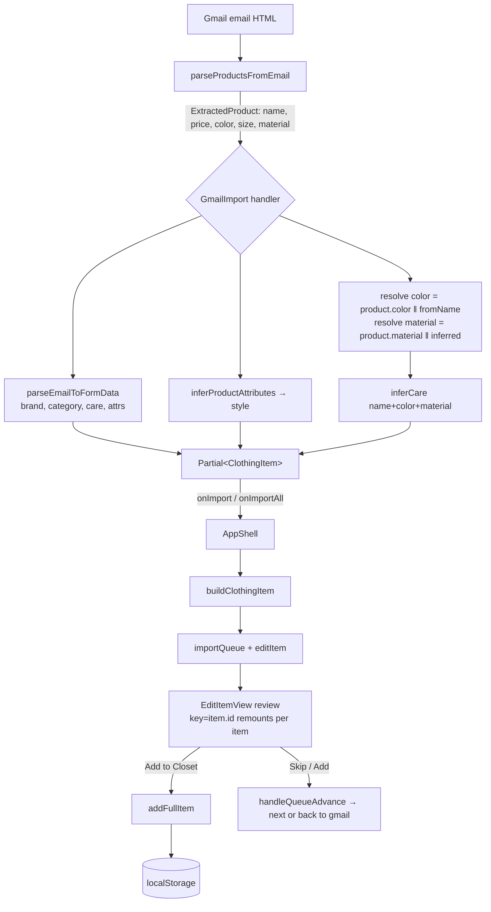
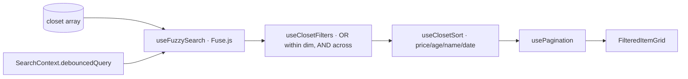

# Architecture — Data Flows & State

> Written 2026-06-14. Reflects `main` (localStorage-only). The Firestore cloud
> layer lives in PR #44 and is **not** on `main` — where this doc says
> "localStorage", the merged version swaps in `useCloudCloset`.

---

## 1. The 30-second model

Closet Inventory is a **single-page React app with no router and no global store.**
Navigation is a `view` string in Context; data is a `ClothingItem[]` array persisted
to one `localStorage` key. Everything else is derived from those two facts.

```
        ┌─────────────── what changes the screen ───────────────┐
view: "carousel" | "overview" | "form" | "edit" | "gmail"
      | "fabric" | "journey" | "entireCloset"        (ViewContext)

        ┌─────────────── what holds the data ───────────────────┐
closet: ClothingItem[]  ⇄  localStorage["my-closet"]   (useLocalCloset)
```

---

## 2. Provider tree (where global state lives)

State is intentionally shallow — three Contexts, each owning one concern.

```
<GoogleOAuthProvider>            main.tsx        — Gmail OAuth client id
└─ <ViewProvider>                context/ViewContext     ← view, previousView, setView
   └─ <SearchProvider>           context/SearchContext   ← searchQuery, debouncedQuery, results
      └─ <AppShell>              App.tsx                 ← THE orchestrator (local useState)
         └─ <EditProvider>       Features/Form/EditContext ← editItem (currently low-use)
            └─ <ToastProvider>   Components/Toast        ← toast queue
               └─ <ErrorBoundary key={view}>            ← resets on navigation
                  └─ {one feature view, switched on `view`}
```

| Context | Owns | Consumed by |
|---|---|---|
| `ViewContext` | `view` / `previousView` / `setView` | NavBar, every feature that navigates |
| `SearchContext` | query + debounced query + Fuse.js results | SearchBar, EntireClosetView |
| `EditContext` | `editItem` handle | Form subtree (light usage) |
| `ToastProvider` | transient notifications | every mutation site |

Everything else is **local component state lifted to `AppShell`** — there is no Redux/Zustand.

---

## 3. AppShell — the orchestrator

`AppShell` (App.tsx) is where most non-global state actually lives and where the
import pipeline is wired. It holds, in plain `useState`:

```
selectedCategory      → which carousel category is open
editItem / editMode   → the item being edited/created + create|edit
importQueue[]         → batch-import items awaiting review
importQueueIndex      → position in that queue
gmailSourceEmailId    → remembers the email you imported from
showOnboarding        → first-run flag (localStorage "closetly-onboarding-complete")
```

It passes **callbacks down** (props), and reads the closet via `useLocalCloset`.
This is the classic "lift state to the nearest common ancestor" pattern — the
ancestor here is the whole app.

---

## 4. Component hierarchy + where state is passed down

```
AppShell (state: view, editItem, importQueue, …; data: useLocalCloset)
│
├─ NavBar ─────────────── props: onAddItem, onExportCloset, onImportCloset, closetItemCount
│
└─ <view> switch:
   │
   ├─ "carousel"   Carousel ──── setCategory ↑ (lifts selectedCategory to AppShell)
   │               Closet ────── selectedCategory ↓, onEditItem ↓
   │                 └─ ClothesCard ── item ↓, onEditItem ↓
   │                      └─ CardDetails ── item ↓, onEdit/onRemove/onExpand ↓
   │
   ├─ "overview"   Closet (same as above, no carousel)
   │
   ├─ "entireCloset" EntireClosetView ── onEditItem ↓
   │                 ├─ SearchSortBar ──── useSearch() (context), local sort state
   │                 ├─ FilterSidePanel ── useClosetFilters() (local hook state)
   │                 ├─ FilterPillsRow ─── active filters ↓, remove cb ↑
   │                 └─ FilteredItemGrid ─ filtered+sorted items ↓
   │                      └─ FilteredCard ── item ↓, match pills ↓
   │
   ├─ "form"       MultiStepForm ── initialData ↓, setView ↑  (9-step local form state)
   │
   ├─ "gmail"      GmailImport ──── onImport ↑, onImportAll ↑, onSourceEmailChange ↑
   │                 ├─ EmailList ──────── emails ↓, onToggleSelect ↑
   │                 └─ EmailPreviewPanel/EmailPreview
   │                      └─ ProductCard ── onImportProduct ↑
   │
   ├─ "edit"       EditItemView ── item ↓, queuePosition/Total ↓,
   │                               onItemAdded/onSkipItem ↑   (key={item.id} → remount per item)
   │
   ├─ "fabric"     InteractiveGuide   (self-contained, reads Content/Fabric&Fiber)
   └─ "journey"    JourneyC           (self-contained visualization)
```

`↓` = passed down as a prop &nbsp;|&nbsp; `↑` = callback that lifts state back to `AppShell`.

---

## 5. Data flow A — manual add (9-step form)



Key point: `addItem` updates React state **and** writes `localStorage` in the same
call, so the grid re-renders from the same hook instance that owns the array.

---

## 6. Data flow B — Gmail import → review → save (the deep pipeline)

This is the app's most involved flow. Color/material/care/style all get resolved
across **two** stages: a generic parse, then a per-product override.



**Category gate + unskip (PR #72):** before products reach the import handler,
`EmailPreview` runs `partitionByCategory` over the parsed list — items that can't map
to a category (and false positives from image-based retailers) are split into a
**skipped** bucket and excluded from import. The user can expand the "N items skipped —
not clothing" notice and click **Include** to move a false positive back into the
importable list (local `unskipped` state). Noise senders are filtered upstream via
`GMAIL_EXCLUDE_SENDERS` in the default query.

**Gotcha (documented in FORWARD_PLAN):** `care` must be computed in the *handler*
from the **resolved** color, because the email's product-card color (`Color: White`)
isn't visible to `parseEmailToFormData` (which only sees the subject). Likewise the
inferred `style` object must be carried through `buildClothingItem` /
`buildFormDataFromItem` / `addFullItem` or it's silently dropped (the
`[key: string]: any` index signature on `ClothingItem` hides the omission from `tsc`).

---

## 7. Data flow C — search + filter + sort (read path)



All four are **pure hooks** over the same array — no writes, fully unit-tested.

---

## 8. Persistence boundary

```
useLocalCloset  ──setItem──▶  localStorage["my-closet"]  (one JSON blob, whole closet)
              ◀─getItem/seed─  MY_CLOSET_DATA (constants) on first load
```

Single source of truth = one `localStorage` key holding the entire `ClothingItem[]`.
**Known constraint:** images are base64-inlined into that blob → ~5 MB mobile-Safari
ceiling (see MOBILE_PLAN 🔴). The cloud version (PR #44) layers Firestore in front
with localStorage as the offline cache, same hook shape (`useCloudCloset`).

---

## 9. Why this architecture holds up

- **No router** → navigation is a testable string; `ErrorBoundary key={view}` makes a
  crash in one screen self-heal on the next navigation.
- **Pure read-path hooks** → search/filter/sort/paginate are trivially unit-tested
  (and are, heavily).
- **One persistence call site** → mutations and re-renders share a hook instance, so
  there's exactly one place sync can go wrong (and one place to add the cloud layer).
- **Shallow context** → three concerns, no prop-drilling of global state; feature
  state is lifted only as far as `AppShell`.
